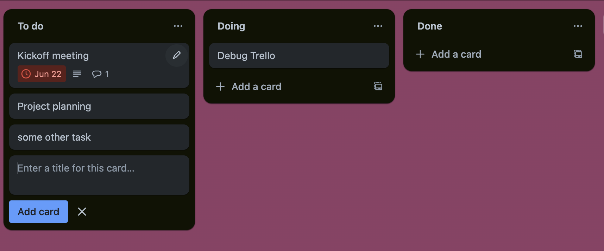

You are tasked with creating an advanced collaborative **Kanban Board**
application using React. A **Kanban Board** is a visual tool used to
manage and track work as it moves through a process. It helps teams
visualize their workflow, identify bottlenecks, and improve efficiency.
The board is divided into columns, each representing a different stage
of the process, such as "To Do," "In Progress," and "Done."

For this technical interview, we would like you to replicate some of the
core functionality of [<u>Trello</u>](https://trello.com/). In
particular we would like you to create a board where users can create
tasks, place them in various stages of their process (“Not started”, “In
Progress”, “Done”, and potentially more).

# Key Features to Implement

We do not want you to implement every feature on Trello, so have
outlined the key features we would like you to implement below. If you
are not able to implement all of the functionalities, that is completely
fine. Our goal is to see your development process, how you overcome
challenges and your fluency with React.

**Overview of Key Functionalities:**

1.  Task Card UI

2.  Editing the title, description, due date, labels, assigned members

3.  Moving Task Cards between Buckets

4.  Deleting Tasks

5.  Adding new tasks

<!-- -->

1.  **Cards**: User should be able to add task cards that include a
    > title and description. Tasks must be editable by clicking on the
    > pen icon in the top right, which brings up a modal to edit the
    > task information. For now do not worry about the right click
    > interaction, but the user should be able to change the following:

    1.  Change Title

    2.  Change description

    3.  Assign the task to specific team members (assume there are 5
        > team members on this board - feel free to make up names for
        > the team members)

    4.  Add/edit labels (tags). For this purpose assume that the tags
        > are (P0, P1, P2, P3, Under Review, Discuss). Each tag should
        > have a distinct color.

    5.  Editing Due Date: Users should be able to choose a date/time

Figure 1: Example trello card. The pen icon in the top right allows me
to edit this card by opening the following moda on the rightl. You can
ignore the functionalities crossed out in red.

-   The functionalities that should be fleshed out are **title,
    > description, due date (in main panel) and members, labels, and
    > dates, move and archive** **(on the right panel).**

**You may ignore the Trellos default functionality below** where a
shortened menu opens up when you click on the pen. **Instead, open the
modal card that allows you to edit the task information directly when
the pen is clicked.**

1.  **Moving Tasks between buckets:**

    1.  By default, there should be 3 buckets on the Kanban Board where
        > tasks may be placed: **To do, Doing, and Done**

    2.  A user should be able to move a task from one bucket to another
        > by **dragging that card** to another component or using the
        > **move action** on the details page.

1.  **Adding lists/stages:** Users should be able to add a new list to
    > their kanban board. When adding a list, it is first initialized to
    > be empty. The only input for adding a list is a title for the list
    > (title is required).

1.  A user should be able to add new task cards to any list. When adding
    > a new task card, the user must enter a title, but other
    > information can be added by opening the details page once saved.

#

# Advanced Features to Implement

Depending on how much time the above takes and your fluency with React,
here are some additional features that you can implement to show off
your expertise. We recommend choosing at least one of these to implement
in your technical interview. Remember that you do not need to implement
all of these! These are here to challenge you!

Deleting Tasks - when a user wants to remove a task from the list, they
should be able to do so with the a delete button in the menu. (**Also
known as archive in trello)**

-   Search Functionality: Implement a search bar that allows users to
    > search for tasks by entering key words found in the title or
    > description of the task.

<!-- -->

-   Sort: Implement sorting functionality for each list. Each list
    > should be sortable by the tags attached to the tasks. Examples of
    > sorting order include:

    -   Priority: placing P0 (urgent) at the top and P3 at the end.

    -   Due Date

    -   Date Added

<!-- -->

-   Filter: Allow users to filter tasks based on the associated
    > labels/tags, the team members assigned to the task, or the time
    > the task was last active

Note: This exercise is not designed for you to create the most complete
implementation. Rather our goal is to evaluate your expertise in
React/Javascript, while also understanding your coding style, problem
solving tactics, etc. You do not need to implement everything outline in
this document! Ideally spend 3-5 hours on this technical interview, but
you can spend more/less time.

To help us understand your code evolution. Please commit your code to
github every 15ish minutes.

# Intellectual Integrity and Honesty

It is of utmost importance that you do not share this problem or your solution with anyone outside of 2Sigma School, in any context, and in any manner. You should not ask anyone for help, directly or indirectly and solve the challenge entirely on your own. Following are DO's and DONT's for your guidance, but above all, please use your judgement.

1. DO search for helpful articles and published materials that are publicly accessible.
1. DO take online courses or read books as you need to learn more about the tools and techniques you might find useful.
1. DO NOT post any questions on how to solve any aspect of this problem on a public forum.
1. DO NOT ask anyone for help solving this problem.
1. DO use ChatGPT to expedite your solution. If you do, you must document what help you received from ChatGPT. You must log the query/response in a separate markdown file called chatgpt.md

# Questions

If you have any questions, please email us at code-interview@2sigma.school and someone will respond back.